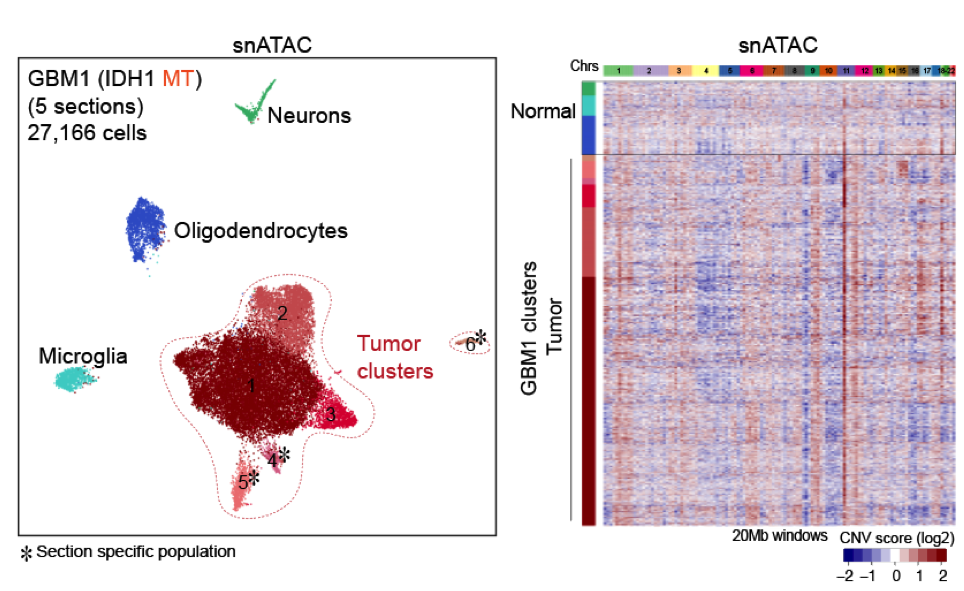

## AAmpD (in development) 
AAmpD is an R package developed to identify focal amplification detection from cluster aggregate of single cell/nuclei ATAC-seq data <br />
Pre-print to be uploaded.

## Installation
The required R packages to use AAmpD are SnapATAC, psych, DNAcopy, GenomicRanges, miscTools, RColorBrewer and ggplot2. Also requires bedtools, igvtools and samtools. To install AAmpD R package:
```
library(devtools)
install_github("rr1859/AAmpD")
library(AAmpD)
```
## Overview of analysis
<br />


## Clustering and peak calling (single cell ATAC-seq data)
Clustering of sc/snATAC-seq data can be performed using [SnapATAC](https://github.com/r3fang/SnapATAC) (used for this publication) or other pipelines
* Example script and R workspace provided in examples/
* Peaks were called for each cluster and merged to get the peak list for each sample
 
### Clustering results of GBM1 (5 sections) and large scale CNV analysis


For scATAC-seq data analyzed using Snaptools/SnapATAC
In analysis folder, save 1) peak BED files, 2) .snap files ,3) bg_reads_50kbsh script, 4) mappability file, 5) genome file and 6) blacklist regions. Example and hg38 files can be found here - http://renlab.sdsc.edu/rraviram/github_example_data
```
library(BSgenome.Hsapiens.UCSC.hg38)
gbm1_atac_s3=readRDS("GBM1_IDHMT_section3.rds")
non_tumor_atac=readRDS("Non_tumor_opc_ast.rds"

#GBM1 tumor sample (section 3)
getBackgroundReads(snap_obj = gbm1_atac_s3, 
                  snap_file = "GBM1_Layer3_only.snap", 
                  clusters = c(1:11),
                  peak_file = "GBM1_peaks.bed", 
                  bin_size= 50e3,
                  genome_file="hg38.chrom.sizes", 
                  sample_prefix="GBM1",
                  output_folder = "AAmpD_bg_reads",
                  path_to_bgreads = '.')

#Non-tumor brain sample (astrocytes, oligogendrocyte progenitor cells)
getBackgroundReads(snap_obj = non_tumor_atac, 
                   snap_file = "Human_brain_2_only.snap",
                   clusters = c(4,6),
                   peak_file = "Non_tumor_peaks.bed", 
                   bin_size= 50e3, 
                   genome_file="hg38.chrom.sizes",
                   sample_prefix="Non_tumor",
                   output_folder = "AAmpD_bg_reads", 
                   path_to_bgreads = '.') 


```
Once background reads have been obtained, run the AAmpD function for selected clusters to obtain regions of focal amplifications in each cluster.
```
tumor_clusters = 1:11
amps_results=sapply(tumor_clusters, AAmpD(path_to_files = "AAmpD_bg_reads",
                                          tumor_prefix = "GBM1", normal_prefix = "Non_tumor", normal_clusters= c(4,6),
                                          mapp_file = "map_hg38_50kb_2.wig",blacklist = "hg38/hg38.blacklist.bed", 
                                          genome = "hg38.chrom.sizes",bin_size = 50e2,sd = 2, cut_off = 3))


```
